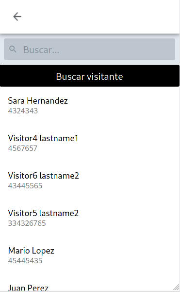

<!-- PROJECT LOGO -->
<br />
<p align="center">
  <a href="https://github.com/d1sd41n/CIES_app_web_frontend">
    
  </a>

  <h3 align="center">CIES App Web Frontend</h3>

  <p align="center">
    An awesome sistem to register the items that enter and leave your facility automatically!!
    <br />
  </p>
</p>

<!-- TABLE OF CONTENTS -->
<details open="open">
  <summary>Table of Contents</summary>
  <ol>
    <li>
      <a href="#about-the-project">About The Project</a>
      <ul>
        <li><a href="#built-with">Built With</a></li>
      </ul>
    </li>
    <li>
      <a href="#getting-started">Getting Started</a>
      <ul>
        <li><a href="#prerequisites">Prerequisites</a></li>
        <li><a href="#installation">Installation</a></li>
      </ul>
    </li>
    <li><a href="#usage">Usage</a></li>
    <li><a href="#roadmap">Roadmap</a></li>
    <li><a href="#contributing">Contributing</a></li>
    <li><a href="#license">License</a></li>
  </ol>
</details>


<!-- ABOUT THE PROJECT -->
## About The Project

CIES is an app to automatically register items that enter and leave a company facilities using QR codes and a cell phone camera. Automatically records in a database all the details of each item that enters or leaves the installation, It also allows to create automatic reports in case of item loss and allows the automatic sending of emails to inform the owner of the lost item if it is found


The project is divided into three subprojects: backend, web frontend, mobile frontend; each one in its respective repository. 
This repository is the moobile frontend code source

Backend: [https://github.com/d1sd41n/CIES_app_backend](https://github.com/d1sd41n/CIES_app_backend)  
Web frontend: [https://github.com/d1sd41n/CIES_app_web_frontend](https://github.com/d1sd41n/CIES_app_web_frontend)

Features implemented in the web frontend:
* Login and user session
* Forms to register visitors and items
* QR code scanner to register items entries or exits
* Items search engine by QR code scan or by visitor
* List all the items of a user
* List the history of entries and exits of items

Here are some screenshots what the UI looks like:

<p float="left">
  
   
  
  
</p>

### Built With

* [react.js](https://reactjs.org/)
* [React Native](https://reactnative.dev/)
* [Expo](https://expo.io/)
<!-- GETTING STARTED -->

### Prerequisites

In order to use this project you must have node.js and expo cli installed on your operating system and you must have the backend working

### Installation

1. Clone the repo
   ```sh
   git clone https://github.com/d1sd41n/CIES_app_frontend_mobile.git
   ```
2- Enter the project directory and install the node packages
  ```sh
   npm i
   ```
3- set the backend domain, replace the string "YOUR_DOMAIN_BACKEND" with the domain where you have hosted the backend in the following modules

src/api/tracker.js
```js
import axios from 'axios';


export default axios.create({
    baseURL: 'http://YOUR_DOMAIN_BACKEND/core/login_token/'
});
```
src/context/AuthContext.js
```js
// more code here...

axios.post('http://YOUR_DOMAIN_BACKEND/core/login_token/', { //send the login to the server
        username: username,
        password: password
    },
 
// more code here...
```

src/variables/backendURL.js
```js
const backendUrl = "http://YOUR_DOMAIN_BACKEND";


export default backendUrl;

```

4- Run the app with Expo and use it in Web mode or on your mobile device

```sh
   expo start
   ```
 <!-- CONTRIBUTING -->
## Contributing

Contributions are what make the open source community such an amazing place to be learn, inspire, and create. Any contributions you make are **greatly appreciated**.

1. Fork the Project
2. Create your Feature Branch (`git checkout -b feature/AmazingFeature`)
3. Commit your Changes (`git commit -m 'Add some AmazingFeature'`)
4. Push to the Branch (`git push origin feature/AmazingFeature`)
5. Open a Pull Request


<!-- LICENSE -->
## License

Distributed under the MIT License. See `LICENSE` for more information.


<!-- CONTACT -->
## Authors

Daniel Pérez - [Twitter](https://twitter.com/1l_dan) - [github.com/d1sd41n](https://github.com/d1sd41n) 
